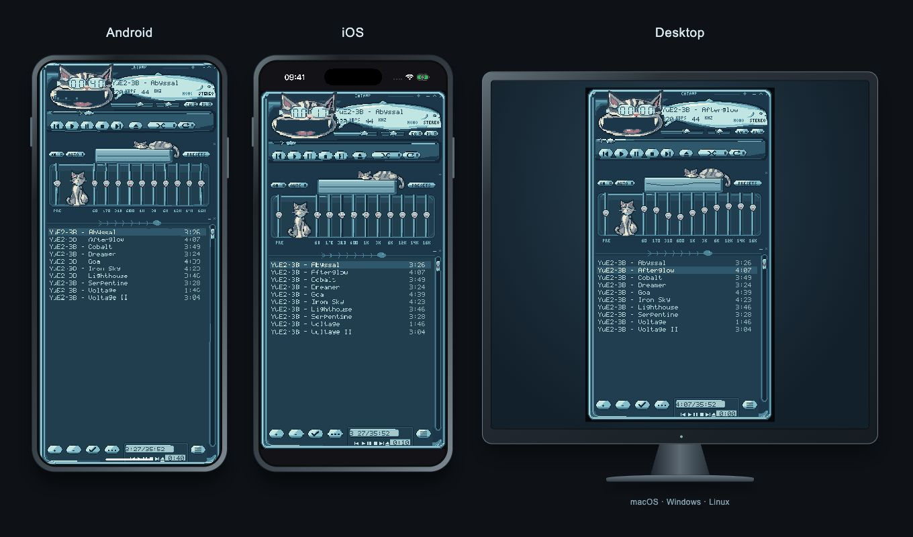
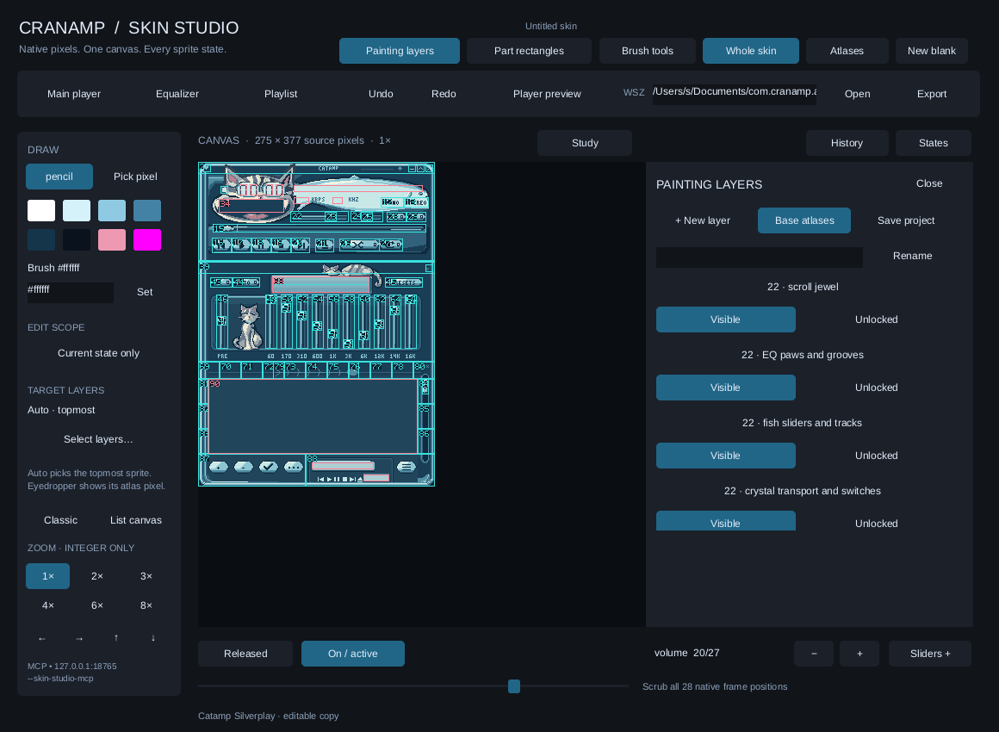
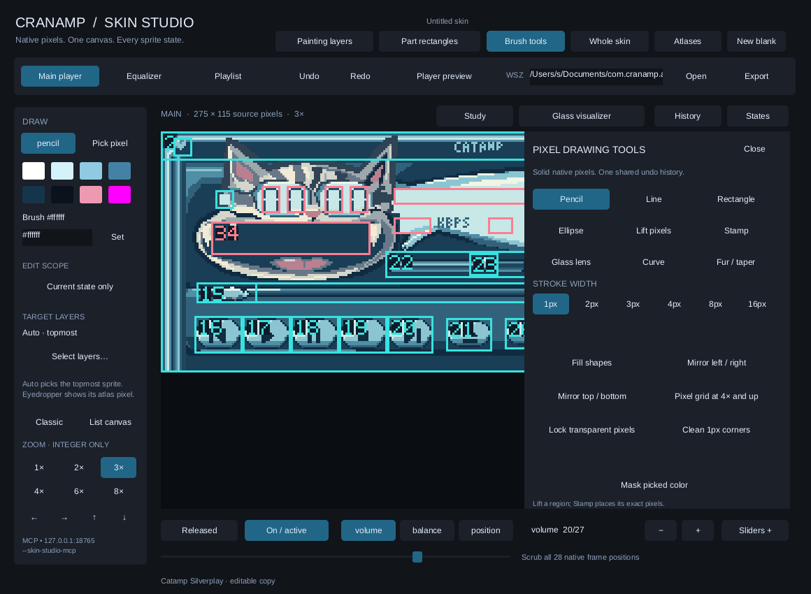

https://github.com/user-attachments/assets/2d95ee4d-d2ff-4568-bb8f-e7fac91c7eae

# Cranamp

A Winamp-style music player in Rust, powered by [Cranpose](https://github.com/samoylenkodmitry/Cranpose).

[Download](https://github.com/samoylenkodmitry/cranamp/releases/latest) · [Play in your browser](https://samoylenkodmitry.github.io/cranamp/) · [Skin Studio](docs/skin-studio/README.md)

- **Platforms** — Windows, macOS, Linux, Android, iOS and web.
- **Catamp** — Nine pixel-cat skins bundled by default: Silverplay, Feral Night, Cat Scan, Seance, Salvage, Freefall, Catnip, Moon Garden and [Midnight Snack](docs/skin-studio/midnight-snack.md).
- **Classic skins** — Import and switch Winamp `.wsz` and `.zip` skins.
- **Skin cursors** — Classic `.cur` pointers per region, wherever the platform has a cursor. Every bundled skin draws its own, and the Skin Studio draws and edits them like any other artwork.
- **Web skin library** — Keep skins and your selection across browser reloads.
- **Local music** — Open audio files and folders through platform file pickers.
- **Streaming** — Play audio URLs and listen to Cranamp FM.
- **Playlists** — Import M3U/M3U8/PLS, export M3U, and open remote playlists.
- **Playlist tools** — Search, multi-select, sort, randomize and remove tracks.
- **Playback** — Play, pause, stop, seek, skip, shuffle and repeat.
- **Sound** — Volume, balance, ten-band equalizer, preamp and presets.
- **Visualizer** — Live spectrum inside your skin.
- **Resume** — Remember playlists, selected skins, volume and EQ settings.
- **Desktop windows** — Move, resize, dock and detach the player panels.
- **Floating web player** — Open PiP explicitly in supported Chromium browsers.
- **Sync** — Share listening progress and play counts through a chosen folder on native platforms.
- **Android updates** — Check for and install new releases from Settings.
- **Skin Studio** — Open the editor from Settings on desktop, Android and the web.
- **Drawing** — Pencil, lines, curves, shapes, pixel stamps, fur strokes and glass tools.
- **Layers** — Edit painting layers, masks and selected skin parts with undo/redo.
- **Connected canvas** — Draw across main, equalizer and playlist with source-part guides.
- **Sprite states** — Preview pressed controls and every slider position at integer zoom.
- **Projects** — Save layered `.cstudio` projects and export classic `.wsz` skins.
- **MCP** — Drive the desktop editor with the same drawing tools and history.

| Connected canvas & painting layers | Pixel tools & source-part guides |
| --- | --- |
|  |  |

https://github.com/user-attachments/assets/8c768bfa-eb62-44f6-9629-9e0ae89e0210

